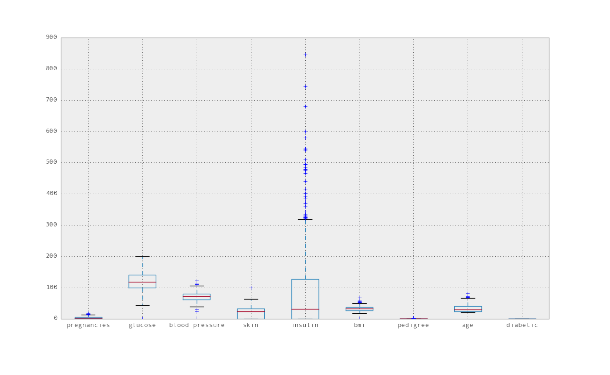
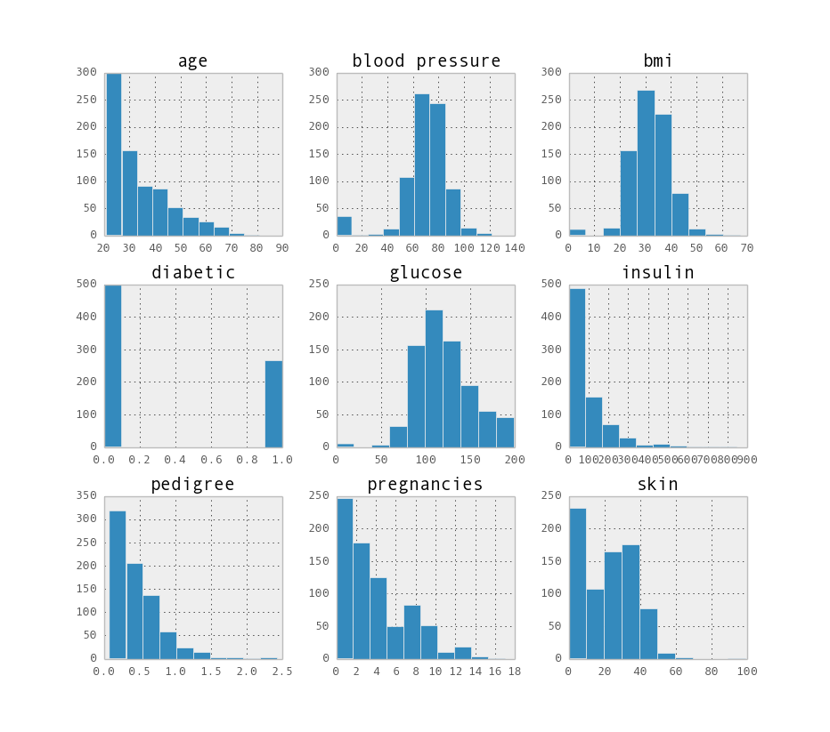
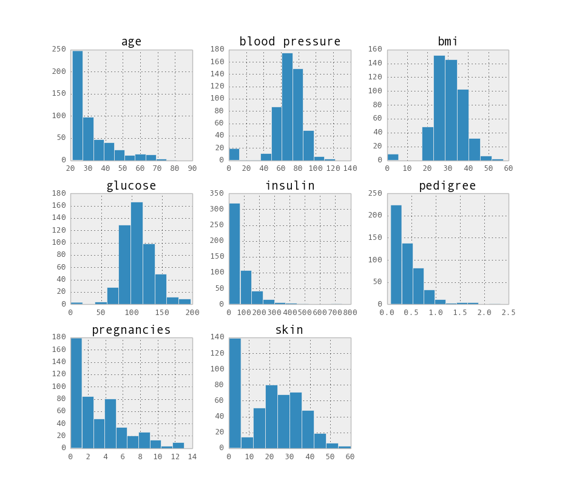
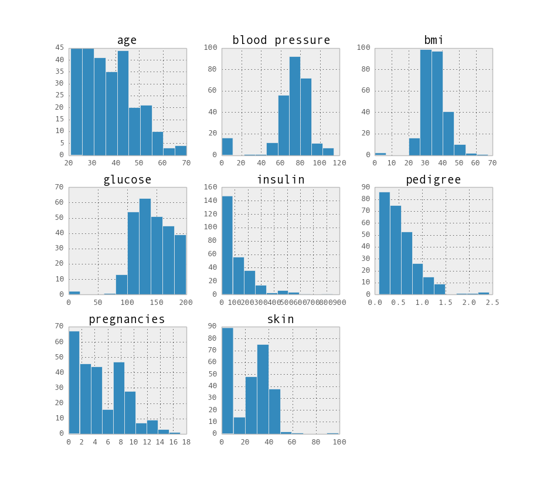
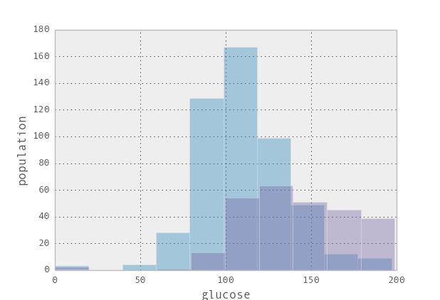
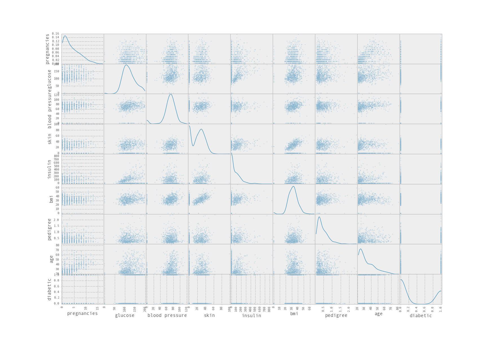
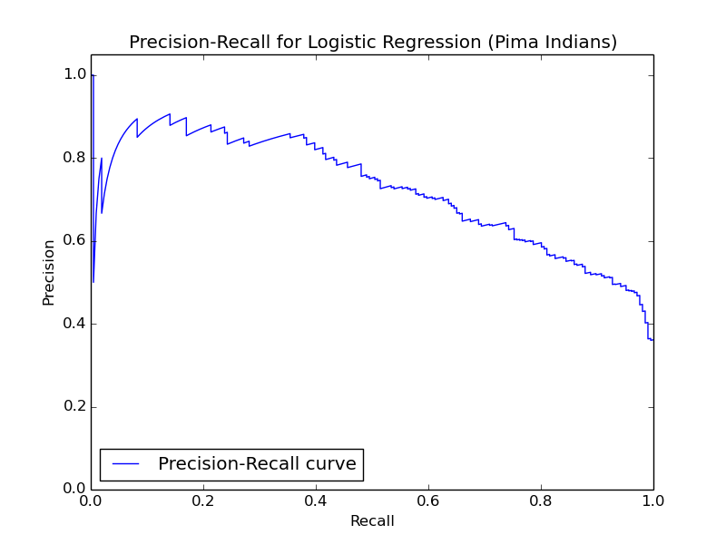
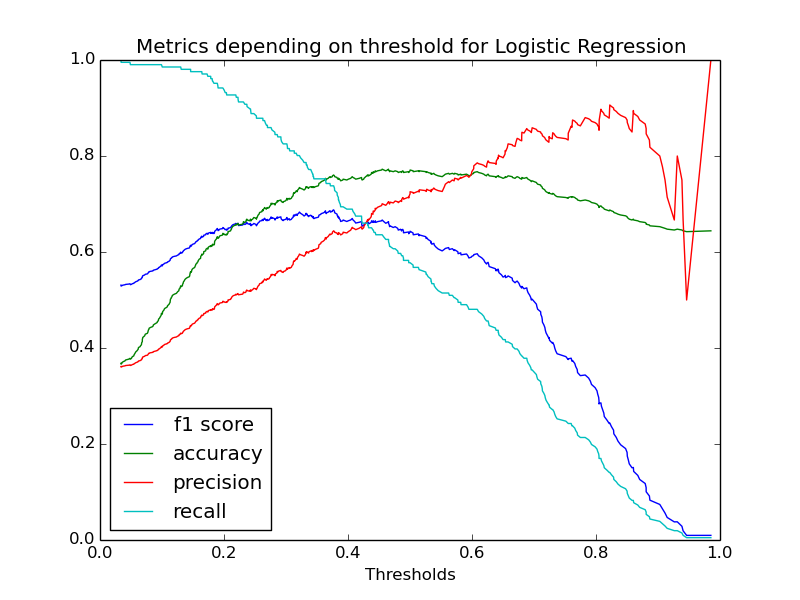

## Pima Indians Diabetes Dataset

Les indiens [Pima](http://en.wikipedia.org/wiki/Pima_people) ("Akimel O'odham") vivent aux alentours de Phoenix en Arizona, aux Etats-Unis. Les femmes Pima présentent une prévalence très importante des cas de diabète (supérieure à dix fois celle du reste de la population), [attentivement suivie](http://diabetes.niddk.nih.gov/dm/pubs/pima/pathfind/pathfind.htm) depuis 1965 par les institutions de santé américaine.


A la fin des années 1980, J.W. Smith *et al.* ont formaté et étudié [ces données](https://archive.ics.uci.edu/ml/datasets/Pima+Indians+Diabetes) devenues classiques dans le domaine des statistiques et du *machine learning*. Leur article initial décrit ces données et les résultats de leur étude avec un premier algorithme :
[Using the ADAP Learning Algorithm to Forecast the Onset of Diabetes Mellitus](http://www.ncbi.nlm.nih.gov/pmc/articles/PMC2245318/), Smith, J.W., Everhart, J.E., Dickson, W.C., Knowler, W.C., & Johannes, R.S. -- *Proceedings of the Symposium on Computer Applications and Medical Care (pp. 261--265).*

L'exploration sera réalisée en Python 2.7 ; l'analyse préliminaire des données avec **Pandas**, le *machine learning* avec **scikit-learn**.

### Analyse préliminaire

Le jeu de données contient les résultats d'analyse pour 768 femmes. 
L'étude originale ayant un objectif prédictif à 5 ans, les femmes ayant déjà été diagnostiquées avant l'analyse ont été écartée du dataset. En revanche, un diabète a été détecté pour 268 d'entre elles dans les cinq ans qui suivent la visite médicale, soit un **taux d'incidence de 34,9%** (7% par an), effectivement très élevé.

En termes de *machine learning*, cela signifie que les populations des deux classes à prédire sont inégales (35% contre 65%). Il pourra donc être plus pertinent d'utiliser des métriques de type *precision*, *recall*, et *score F1* plutôt que la simple *accuracy*.

Les *features* (les valeurs mesurées) sont :

* *pregnancies* : nombre de grossesses
* *glucose* : concentration de glucose dans le plasma sanguin deux heures après [l'ingestion d'une dose standardisée](http://en.wikipedia.org/wiki/Glucose_tolerance_test#Standard_OGTT) (mg/dl)
* *blood pressure* : pression artérielle (diastolique) (mm Hg)
* *skin* : [épaisseur de la peau](http://www.topendsports.com/testing/skinfold-tricep.htm) au niveau du triceps (mm), mesure apparemment corrélée à la masse graisseuse
* *insulin* : quantité d'insuline dans le sang deux heures après ingestion de glucose (mm U/ml)
* *bmi* : body mass index (poids en kg / carré de la hauteur en mètres)
* *pedigree* : résultat d'une fonction assez complexe, décrite dans la publication de J.W. Smith *et al* citée plus haut, et qui traduit la densité de membres de la famile déjà diagnostiqués comme diabétiques, pondérée par la proximité du parent (les pères, mères, frères, soeurs ont plus de poids que les cousins, etc.). Valeurs comprises entre 0.078 et 2.420 sur le dataset étudié.
* *age* : en années

On constate que toutes ces *features* sont des nombres, dont la plupart (à part le nombre de grossesses et l'âge) sont continues.

Analyse statistique des *features*:
```>>> pima.describe()```

| &nbsp; | pregnancies | glucose    | blood pressure | skin       | insulin    | bmi        | pedigree   | age        |
|--------|-------------|------------|----------------|------------|------------|------------|------------|------------|
| mean   |  3.845052   | 120.894531 |  69.105469     | 20.536458  |  79.799479 |  31.992578 |   0.471876 |  33.240885 |
| std    |  3.369578   |  31.972618 |  19.355807     | 15.952218  | 115.244002 |   7.884160 |   0.331329 |  11.760232 |
| min    |  0.000000   |   0.000000 |   0.000000     |  0.000000  |   0.000000 |   0.000000 |   0.078000 |  21.000000 |
| 25%    |  1.000000   |  99.000000 |  62.000000     |  0.000000  |   0.000000 |  27.300000 |   0.243750 |  24.000000 |
| 50%    |  3.000000   | 117.000000 |  72.000000     | 23.000000  |  30.500000 |  32.000000 |   0.372500 |  29.000000 |
| 75%    |  6.000000   | 140.250000 |  80.000000     | 32.000000  | 127.250000 |  36.600000 |   0.626250 |  41.000000 |
| max    | 17.000000   | 199.000000 | 122.000000     | 99.000000  | 846.000000 |  67.100000 |   2.420000 |  81.000000 |

On peut voir qu'il existe des lignes avec un body mass index à zéro, ce qui signifie une donnée manquante, qu'il faudra probablement remplacer par une valeur raisonnable.
Même remarque pour l'épaisseur de la peau au triceps et la pression artérielle.
 
#### Graphes
On trace le *boxplot* de la répartition des *features* :



On constate que la mesure du *glucose* est bornée à 200 mg/dl, car un patient au delà de cette valeur est considéré comme diabétique au moment du test et que ces patients ont été exclus du dataset.

Histogramme des *features* :



Le même histogramme, séparé entre les résultats pour les femmes non-diabétiques :
```>>> pima.groupby('diabetic').hist()```



...et pour les femmes diabétiques :



On constate que la courbe de pression artérielle est décalée vers les valeurs élevées pour les femmes diabétiques.

La courbe pour le taux de glucose est notablement différente. On peut superposer les deux histogrammes (femmes diabétiques [foncé] et non-diabétiques [clair]) :



Il y a superposition, ce qui indique que cette *feature* ne pourra suffire à elle seule à prédire un diabète. Toutefois, la forme différente des histogrammes semble indiquer qu'elle sera déterminante dans la prédiction.

Enfin, on trace les graphes de la matrice de covariance entre les *features*, avec leurs densités sur la diagonale :



On peut y rechercher des corrélations, comme celle assez claire entre l'épaisseur de peau au triceps et le body mass index.
On constate également (dernières ligne et colonne) qu'aucune *feature* ne présente une transition nette et donc ne permet de prédire seule la future incidence du diabéte.

### Préparation des données
> [02_logisticreg.py](02_logisticreg.py)

La première étape consiste à préparer les données avant d'appliquer un algorithme.
On remplace les valeurs à zéro de **body mass index**, **pression artérielle** et **épaisseur de peau au triceps** par la valeur moyenne de ce feature sur l'ensemble des données.

Ensuite, on standardise les valeurs : pour chaque feature, on retire à chaque valeur la moyenne du feature (pour se centrer sur 0.0) et on la divise par l'écart type (pour que celui-ci soit désormais de 1.0). On a ainsi des *features* qui sont toutes centrées autour de zéro et à peu près de même amplitude. Cela permet d'éviter un éventuel effet de masse des *features* qui peuvent atteindre des valeurs larges (comme le **taux d'insuline**) par rapport à celles qui restent faibles (comme le **nombre de grossesses**).

Enfin, on divise aléatoirement les données concernant les 768 femmes en deux ensembles (avec ```train_test_split()```) :

* un jeu d'apprentissage comprenant 75% des individus (576 femmes),
* un jeu de test, pour la validation, comprenant les 25% restant (192 femmes).

L'apprentissage et l'affinage des paramètres seront réalisés sur le premier ensemble, le calcul des scores finaux sur le deuxième.

### Régression Logistique
Le premier modèle envisagé est une régression logistique.

#### Cross-validation
Les calculs de score sur le jeu d'apprentissage seront réalisés par cross-validation en **5** passes avec un algorithme de **KFold stratifié**, c'est à dire un KFold pour lequel le pourcentage de chaque classe dans l'ensemble du jeu d'apprentissage (diabétique ou non) est conservé dans les deux sous-ensembles utilisés à chaque passe. Les scores de chacune des 5 passes seront au final aggrégés dans une moyenne.

#### Paramètre C
Les régressions logistiques ont un paramètre "de régularisation" **C** à fixer. On réalise ici une "grid search" pour trouver la meilleure valeur. Etant donné la disproportion entre les deux classes, on utilisera le score F1 pour piloter la recherche de la valeur optimale.
```gridsearch = grid_search.GridSearchCV(LogisticRegression(), {'C': [0.001, 0.003, 0.01, 0.03, 0.1, 0.3, 1, 3, 10, 30]}, cv=StratifiedKFold(train_target, n_folds=5), scoring='f1')```

La valeur optimale trouvée pour le paramètre **C** est : **0.1**.
Le score F1 correspondant (en *stratified KFold* sur les données d'apprentissage) est de 0.64008.

#### Apprentissage et test du modèle
On réalise le *fit()* du modèle sur l'ensemble des doonées du jeu d'apprentissage avec **C=0.1**, ce qui permet de réaliser la prédiction sur le jeu de test et de la comparer avec la prévalence effective à 5 ans :

| &nbsp;                | *Accuracy* | Score F1 |
|-----------------------|------------|----------|
| Régression Logistique | 0.78646    | 0.62     |

Les facteurs de chaque *feature* ("scalée") dans le modèle sont les suivants :

| *biais* | pregnancies | glucose    | blood pressure | skin       | insulin    | bmi        | pedigree   | age        |
|--------|-------------|------------|----------------|------------|------------|------------|------------|------------|
| -0.71 | 0.26 | 0.90 | -0.12 | -0.02 | -0.05 | 0.60 | 0.25 | 0.23 |

On constate que le **taux de glucose** est le *feature* le plus déterminant, suivi par le **body mass index**, puis à peu près avec la même importance du **nombre de grossesses**, du **pedigree** et de l'**âge**.

#### Etude sur precision / recall / seuil
La métrique de *precision* est définie comme ratio des femmes réellement diabétiques parmi celles qui ont été prédites comme telles (c'est à dire le ratio des *true positive* sur le décompte des *true + false positive*).
Le *recall* ("rappel") est défini comme le ratio des femmes  **prédites** comme diabétiques parmi celles qui le sont réellement (c'est à dire le ratio des *true positive* sur le décompte des *true positive* + *false negative*).

On trace les courbes de ces deux métriques en fonction du seuil de prédiction du modèle (valeur de la régression au-dessus de laquelle on prédit qu'une femme va se révéler diabétique dans les cinq ans) :



L'objectif est de trouver le seuil pour lequel on a des valeurs acceptables pour les deux métriques. Le score F1 est une combinaison (la moyenne harmonique) de ces deux métriques.

On trace également ces métriques en fonction des différentes valeurs de seuil possible (entre 0 et 1) :



Grâce à cette figure, on constate qu'on peut gagner en *recall* et en score F1 en baissant légèrement le seuil "par défaut" de 0.5, tout en ne perdant que très modérément de l'*accuracy*.

#### Prévisions du modèle avec seuil = 0.45
En choisissant un seuil de 0.45 sur le même modèle (inutile de recommencer l'apprentissage), on obtient les scores suivants :

| &nbsp;                | *Accuracy* | Score F1 |
|-----------------------|------------|----------|
| Régression Logistique | 0.78646    | 0.62     |
| Rég. Logistique seuil=0.45 | 0.78125 | 0.64   |

### Perceptron
Le perceptron est un modèle linéaire comme la régression logistique, qui affecte des poids à chaque *feature* et produit une prédiction en convertissant le résultat (entier) en une valeur binaire.
La différence réside dans l'algorithme d'apprentissage : le perceptron est mis en place comme un "réseau" de neurones à un seul neurone, et l'entraînement a lieu par back-propagation, c'est à dire par modification des poids (initialisés arbitrairement) de chaque *feature* en proportion du delta entre la valeur prédite et la valeur connue (en bouclant **n** fois sur l'ensemble des données d'apprentissage). Cette proportion est pilotée par un facteur **alpha**, nommé le taux d'apprentissage (*learning rate*).

#### Paramétrage et score
Les deux paramètres principaux **n** (nombre d'itérations sur le jeu d'apprentissage) et **alpha** (facteur de multiplication du delta entre valeurs prédites et connues pour la back-propagation) sont explorés par Grid Search.

On constate que la valeur de **alpha** n'a pas d'impact sur le modèle (même score F1 quel que soit la valeur de **alpha** entre 0.0001 et 0.3). On garde donc le défaut pour ce paramètre de scikit-learn : **0.0001**.

| &nbsp; | **n** | **alpha** |
|--------|-------|-----------|
| Paramètres | 15 | 0.0001 |

Le score F1 de cross-validation obtenu (sur les données d'apprentissage) est 0.56183.

Sur le jeu de test, on obtient les scores :

| &nbsp;                | *Accuracy* | Score F1 |
|-----------------------|------------|----------|
| Régression Logistique | 0.78646    | 0.62     |
| Rég. Logistique seuil=0.45 | 0.78125 | 0.64   |
| Perceptron            | 0.72917    | 0.54     |

Les scores étant sensiblement plus faibles que la régression logistique, on ne poursuit pas l'étude avec cet algorithme.

### K-Nearest Neighbors
Le modèle des **K** plus proches voisins est l'un des plus simples utilisable en machine learning, tout en restant très efficace.
Pour chaque élément à prédire, on trouve ses **K** plus proches voisins issus du jeu d'apprentissage (dans l'hyper-espace formé par les *features*). La class prédite (diabétique ou non) sera celle rencontrée dans la majorité de ces voisins.

On choisit d'explorer deux paramètres en Grid Search :

* **K** : le nombre de voisins considérés ;
* **weigths** : la pondération de la classe de chaque voisin dans le "vote" déterminant la classe prédite. Avec ```'uniform'```, il n'y a pas de pondération et chaque voisin apporte un "vote" ; avec ```'distance'```, la classe de chaque voisin est pondérée par l'inverse de la distance euclidienne entre ce point et le point pour lequel on veut réaliser la prédiction. Ainsi, plus un voisin est proche, plus fortement il contribue à la prédiction finale.

On obtient les valeurs optimales suivantes :

| &nbsp; | **K** | **weights** |
|--------|-------|-----------|
| Paramètres | 5 | uniform   |

C'est à dire exactement les valeurs par défaut du modèle ```KNeighborsClassifier``` dans scikit-learn !

La cross-validation donne un score F1 de 0.59071.

Sur le jeu de test, on obtient les scores :

| &nbsp;                | *Accuracy* | Score F1 |
|-----------------------|------------|----------|
| Régression Logistique | 0.78646    | 0.62     |
| Rég. Logistique seuil=0.45 | 0.78125 | 0.64   |
| Perceptron            | 0.72917    | 0.54     |
| K-Nearest Neighbors   | 0.77083    | 0.60     |

Les résultats sont acceptables, mais pas aussi satisfaisant que ceux de la régression logistique.

> Written with [StackEdit](https://stackedit.io/).