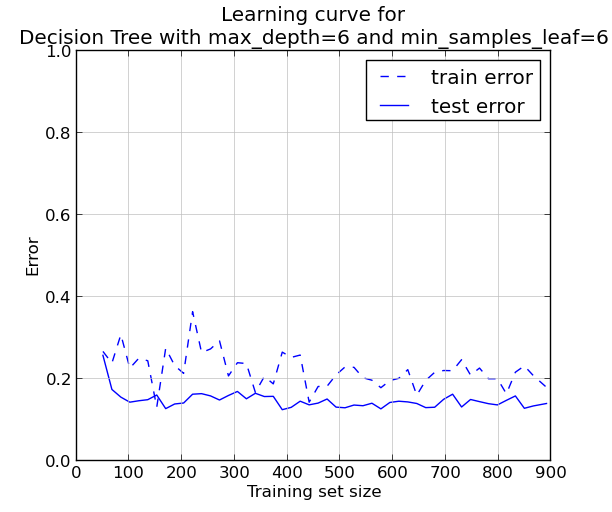

Etude du dataset Titanic
========================

### Présentation
Ce jeu de données est proposé par [Kaggle.com](http://www.kaggle.com/c/titanic-gettingStarted) comme projet d'initiation.
Les données rassemblent le nom et certaines caractéristiques des 1309 passagers du Titanic, divisées en deux ensembles :
- les données d'entraînement ([train.csv](train.csv)), comprenant 891 passagers, avec pour chacun d'entre eux un flag (0 ou 1) indiquant s'il a survécu au naufrage ;
- les données de test ([test.csv](test.csv)), comprenant les 418 passagers restant, pour lesquels l'objectif est de prédire s'ils ont survécu ou non.

Les participants au concours soumettent leurs prédictions au site Kaggle.com, qui les évalue sur 50% (non révélés) des données de test. A l'issue du concours, le classement final sera établi sur le score obtenu pour les 50% restant.

Les données fournies pour chaque passager sont les suivantes :  **Classe** du voyageur (1ère, 2ème ou 3ème), **Nom** complet, **Sexe**, **Age**, Nombre de **conjoints, frères et soeurs** à bord, Nombre de **parents et enfants** à bord, Référence du **billet** d'embarquement, **Tarif** du billet d'embarquement, Référence de la **cabine**, Port d'**embarquement** (Cherbourg, Southampton ou Queenstown (Irlande)).

L'exploration a été réalisée en Python 2.7.

### Première analyse des données
> [01_first_steps.py](01_first_steps.py)

Un passage préliminaire sur les données d'apprentissage fait apparaître que 38,4% des passagers de ce fichier ont survécu.
Cependant, le taux de survie est nettement plus contrasté si l'on divise la population selon le sexe et selon le prix déboursé comme le ticket :

| Prix du billet 	| < £10 	| £10 <= prix < £20 	| £20 <= prix < £30 	| £30 <= prix 	|
|----------------	|-------	|-------------------	|-------------------	|-------------	|
| Hommes         	| 10,6% 	| 18,8%             	| 24,1%             	| 33,6%       	|
| Femmes         	| 59,4% 	| 73,1%             	| 68,4%             	| 86,1%       	|

### Modèle *ad hoc*
Compte-tenu de cette analyse assez rapide et aisée, il est possible de mettre en place un modèle de prédiction *ad hoc* sans faire intervenir un algorithme d'apprentissage. (Ce modèle est proposé par le tutoriel associé au concours sur le site de Kaggle.com).
A ces deux variables discriminantes (sexe et prix du billet), on ajoute la classe de la cabine.

#### Processus
- Rassembler les passagers en 24 catégories (2 sexes x 3 classes x 4 intervalles de prix) ;
- Pour chaque catégorie, calculer le taux de survie dans le jeu de données d'entraînement ;
- Pour chaque passager du jeu de test, déterminer dans quelle catégorie il ou elle se trouve, et prédire sa survie si le taux de survie de cette catégorie est >= 50%.

#### Difficultés
- Les prix des billets sont simplifiés en 4 intervalles de prix ; il faut transformer le prix pour chaque passager en l'index de l'intervalle correspondant (exemple : un tarif de £12 sera dans le deuxième intervalle, entre £10 et £20).
- Certaines catégories ne correspondent à aucun passager du jeu de données d'apprentissage ; le taux de survie est alors placé arbitrairement à 0%. Après tout, le taux de survie global pour tous les passagers (38,4%) est inférieur à 50%.
- Le prix du billet (*fare*) n'est pas renseigné pour tous les passagers. Dans ce cas, on fait le choix d'utiliser la classe pour approximer l'intervalle de prix :

| Classe     | 1ère   | 2ème   | 3ème |
|------------|--------|--------|------|
| Intervalle approx. | £20-30 | £10-20 | <£10 |

#### Score
Le score utilisé dans ce concours est l'*Accuracy*. Celle-ci peut se représenter :

> *Accuracy = Nombre de prédictions correctes / Nombre total de prédictions.*

Sur notre jeu de données d'apprentissage, cette valeur donne **0.80808**.
Toutefois, le score sur les données qui ont servies à l'apprentissage n'est pas fiable pour évaluer la capacité prédictive d'un modèle.

J'ai généré les [prédictions de ce modèle](01_submission.csv) sur les données de test que j'ai uploadé sur le site Kaggle.com ; son *Accuracy* (sur 50% du jeu de test) est évaluée à **0.77990**.

### Utilisation du framework Pandas
> [02_with_pandas.py](02_with_pandas.py)

La librairie **Pandas** facilite le chargement et la manipulation de données sous forme structurée. Elle sera utilisée dans le reste des travaux pour, notamment, aisément charger les fichiers et faire référence aux colonnes de données (les *features*) par leur nom. Par exemple :
```python
data = pandas.read_csv('train.csv', header=0)  # feature names on line 0
Y = data['Survived']
```

Plutôt que :
```python
data = []
with open('train.csv', 'r') as f:
	for row in csv.reader(f):
		data.append(row)
data = numpy.array(train[1:])
Y = data[:, 1]
```

Le même modèle *ad hoc* est ré-implémenté en utilisant les structures de données Pandas (nommées *dataframes*).
Les prédictions sont, fort heureusement, les mêmes.

Ce travail n'apporte pas de valeur à l'exploration statistique mais permettra de faciliter le codage ultérieur et de lui apporter de la lisibilité.

### "Nettoyage" des données
On constate sur ce jeu de données un inconvénient souvent présent dans les travaux de *machine learning* : l'absence de certaines données (*features*) pour certains passagers.

Il n'y a pas vraiment de règles absolues dans ce cas. On peut laisser les valeurs "absentes" dans les données, avec des conséquences variables selon l'algorithme utilisé. Alternativement on peut remplacer ces valeurs "absentes" par des **valeurs raisonnables**, mais la détermination de celles-ci est alors un paramètre (potentiellement important) du modèle choisi.

#### Age
On constate que **20% des passagers** n'ont pas d'âge précisé, que ce soit pour le jeu d'apprentissage ou le jeu de test.
La stratégie adoptée est de remplacer les données manquantes par l'âge médian des passagers du jeu d'apprentissage de mêmes sexe et classe.

#### Prix du billet
Un passager dans le jeu de test (et aucun dans le jeu d'apprentissage) n'a pas de prix spécifié. S'agissant d'un seul cas sur 1309, on prend le parti de remplacer ce prix absent par 0.

### Régression Logistique
> [03_logistic_regression.py](03_logistic_regression.py)

Le premier algorithme non *ad hoc* essayé est la régression logistique. De manière simplifiée, il s'agit d'une régression linéaire dont les paramètres sont les poids des différentes *features*, plus un terme de "biais" (càd d'ordonnée à l'origine), et dont le résultat est passé dans une fonction sigmoïde afin de le rendre binaire (le passager a-t-il survécu ou pas ?).

La librairie utilisée dans cette exploration est **[scikit-learn](http://scikit-learn.org)**.

#### Paramètre de régularisation
La mise en place d'un modèle de régression logistique nécessite de fixer la valeur d'un paramètre *C*, qui représente l'inverse du paramètre de régularisation lambda.

Ce paramètre est destiné à prévenir le risque d'*overfitting*, c'est à dire d'obtenir un modèle très performant sur les données d'apprentissage, mais **non généralisable** pour la prédiction de données ultérieures.

La fonction de coût qui est optimisée (c'est à dire minimisée) pour mettre en place un algorithme de régression logistique est la suivante :
> *J(T) = [ Somme(Erreurs) + (1 / C ) x Somme(T^2) ] / (2 x m) *
T étant le vecteur des poids des différentes *features*
m étant le nombre d'exemples (de passagers) dans le jeu d'apprentissage

"*Erreurs*" représente ici le vecteur des différences entre les valeurs prédites et les valeurs connues pour la donnée à prédire (le passager a-t-il survécu ?).
On obtient donc un compromis entre la modélisation des données du jeu d'apprentissage (le premier terme de l'addition) et le fait que **les poids doivent rester de magnitude raisonnable** (le second terme) pour limiter l'*overfitting*.

*C* permet de régler l'intensité du second terme, et donc l'intensité de la régularisation. L'existence de ce paramètre pose la question de sa valeur optimale, qui doit être ré-évaluée pour chaque jeu de données particulier.

#### Cross-validation
Comme vu plus haut, le calcul du score d'un modèle sur les données d'apprentissage qui ont servi à le déterminer n'a pas beaucoup de valeur : un score élevé ne présageant pas d'une bonne généralisation ultérieure (par exemple en cas d'*overfitting*).

Toutefois, le jeu de test fourni de propose pas l'information de survie des passagers qui le composent. Il est donc impossible de l'utiliser pour mesurer un score et **comparer rapidement des modèles entre eux** (on peut uploader les prédictions sur Kaggle.com et vérifier le score sur 50% du jeu de test, mais d'une part le processus est manuel, et d'autre part il est limité à 10 tentatives par tranche de 12 heures).

La technique de la cross-validation permet de mesurer un **score objectif pour un modèle**, uniquement à partir des données d'apprentissage. Le principe est de scinder le jeu d'apprentissage en deux ensembles représentant (par exemple) 70% et 30% des données, de générer le modèle par l'apprentissage sur les 70%, et de calculer le score sur les 30% restant.

Pour cette exploration, on a utilisé l'algorithme **K-Fold**, qui applique ce principe en le répétant *K* fois avec deux ensembles d'apprentissage et de validation différents à chaque fois, et fait la moyenne des *K* scores ainsi calculés pour déterminer le score final.

On a pris *K* = **8**, de sorte que chaque passe a été réalisée avec 7/8 = 87,5% de train.csv pour l'apprentissage et 12,5% pour le calcul du score (1145 et 164 passagers respectivement).

**Cette cross-validation a été employée pour tous les calculs de score présentés dans la suite de ce compte-rendu** (hormis les scores fournis par Kaggle.com après upload des prédiction sur les données de test).

#### Détermination du paramètre *C*
Un algorithme de régression logistique est entraîné sur les données d'apprentissage pour une série croissante de valeurs de *C* (de 0.01 à 9), le score pour chaque valeur étant calculé par cross-validation en K-Fold avec K=8.


On constate que le score est à son maximum pour une valeur de *C* = **3**. Le score de cross-validation est alors de **0.80472**.

#### Poids des *features*
Une fois les meilleurs paramètres définis, on calcule un modèle définitif avec ces paramètres et sur **l'ensemble** des passagers des données d'apprentissage.

Scikit-learn fournit les poids p[x] des différentes features déterminées par son modèle, ainsi que le "biais" (ou ordonnée à l'origine) :
> *Prédiction = sigmoïde( biais + p[classe] x classe + p[prix] x prix + p[sexe] x sexe + ...)*

Les poids déterminés sont les suivants :

| Biais | Classe | Prix   | Sexe | Embarquement | Age   | Famille à bord |
|-------|--------|--------|------|--------------|-------|----------------|
| 4,81  | -1,04  | 0.0035 | -2,65| -0,14        | -0,038| -0,23          |

Sexe est converti en 0 pour les femmes, 1 pour les hommes.
Le port d'embarquement est converti en 0 pour Cherbourg, 1 pour Southampton, 2 pour Queenstown (en Irlande).
La *feature* famille à bord est la somme des *features* nombre de conjoints, frères et soeurs et nombre de parents et enfants.

On constate que le **prix** est la seule caractéristique corrélée positivement : avoir payé un billet plus cher offre une chance de survie plus importante.
En revanche les autres poids sont négatifs, signalant une corrélation négative :

* Le **sexe** est la caractéristique la plus discriminante pour la prédiction, et être un homme réduit drastiquement les chances de survie. Cela correspond bien à l'analyse préliminaire (et sera confirmé par les algorithmes ultérieurs).
* La **classe** est un indicateur assez fort ; on note qu'une classe de valeur plus grande signifie en réalité un statut à bord moins élevé (la 1ère classe est plus confortable que la 3ème). Le modèle *ad hoc* ayant montré que les taux de survie augmentaient avec le prix et la classe, la corrélation négative est logique.
* La présence de **famille à bord** est corrélée de façon légèrement négative avec la survie, ce qui s'explique peut-être par la plus grande difficulté à évacuer le navire pour des groupes.
* Etonnament, le **port d'embarquement** est corrélé négativement lui aussi : embarquer en France assure plus de chances de survie qu'en Irlande...
* L'**âge** des passager est corrélé négativement, ce qui confirme l'adage "les femmes et les enfants d'abord". Le poids est très faible mais on peut remarquer que l'âge et le prix sont les deux *features* dont l'intervalle de valeurs est beaucoup plus large que les autres. Il est donc logique que les poids leur correspondant soient plus faibles.

#### Prédictions sur les données de test
Ce modèle peut ensuite être utilisé pour établir les prédictions concernant les passagers des données de test.

Soumis sur le site Kaggle.com, le score sur les données de test est de **0.57895**.

|&nbsp;| Score d'apprentissage | Score de test Kaggle.com |
|------|-----------------------|--------------------------|
| Modèle *ad hoc* | 0.80808 | 0.77990 |
| Régression logistique | 0.80472 | 0.57895 |

On constate que la régression logistique a un score quasiment semblable à celui du modèle *ad hoc* sur les données d'apprentissage, mais beaucoup plus faible sur les données de test. On a donc clairement un type de modèle qui ne se généralise pas bien.
Il est nécessaire de déterminer pourquoi la régression logistique n'est pas applicable au jeu de données.

#### Learning curve
Tracer la "learning curve" permet d'identifier si le modèle est approprié aux données. 

* On prélève aléatoirement une portion du jeu d'apprentissage (ici 30%) comme données de "test" ;
* On prépare le modèle avec des sous-ensembles aléatoires et de taille croissante des données restantes (ici, de 50 passagers aux 70% restants, c'est à dire 916) ;
* Pour chacun de ces modèles on calcule l'*Erreur* (*Erreur = 1.0 - Accuracy*) sur le jeu d'apprentissage et sur les données de "test" prélevées initialement.

En traçant ces deux courbes en fonction de la taille du jeu d'apprentissage effectivement utilisé, on peut constater la façon dont le modèle s'affine ou non avec plus d'informations en entrée.


Ce graphe montre que **l'augmentation de la population** du jeu d'apprentissage ne permet pas d'améliorer le taux d'erreur sur les données "de test". De plus, l'écart entre les scores sur le jeu d'apprentissage et le jeu de test est faible et constant.

Ces propriétés sont caractéristiques d'un modèle présentant trop de "bias", c'est à dire **pas assez complexe** pour reproduire la réalité du phénomène que l'on cherche à produire.

Effectivement, la régression logistique reste un modèle linéaire (un "simple" poids donné à chaque *feature*). La prochaine étape sera donc d'appliquer des modèles plus complexes.

### Arbres de décision
> [04_trees_and_forests.py](04_trees_and_forests.py)

Un arbre de décision est un algorithme similaire au modèle *ad hoc* décrit plus haut, mais dont la génération est automatique.

Le processus consiste à déterminer quelle *feature* est la plus déterminante sur la population des données d'apprentissage, et quelle valeur de seuil sépare cette population en deux ensembles de prédiction opposée. Cette *feature* et ce seuil représentent le noeud racine de l'arbre.
Puis, on itère sur chaque fils, c'est à dire sur chaque sous-ensemble de la population, pour déterminer à nouveau la *feature* la plus discriminante et la valeur de seuil la plus appropriée.
Les feuilles de l'arbre contiennent chacune un sous-ensemble de la population du jeu d'apprentissage, et en prenant le *mode* (la valeur la plus fréquente) de la classe évaluée (ici, le passager a-t-il survécu ?), on obtient la valeur à prédire pour un passager des données de test.

Pour ce problème, un arbre de décision dont on limite arbitrairement la profondeur à 3 donne ceci :


On peut noter que, par exemple, les 369 passagers du jeu d'apprentissage rassemblés dans la feuille en bas à droite n'ont pas tous péri dans le naufrage. Cependant, la majorité d'entre eux (le *mode*) étant décédés, on prédira "A survécu" = 0 ici (comme dans le modèle *ad hoc* on prédisait 0 si le taux de survie était inférieur à 50%).

#### Exploration des paramètres de l'arbre de décision
Avec les paramètres par défaut proposés par scikit-learn, l'arbre de décision produit une *Accuracy* de **0.79363** (score obtenu avec la cross-validation en K-Fold habituelle).

Ce score est plus faible que celui du modèle *ad hoc* (pour rappel : 0.80808). Cependant, par rapport à ce dernier, l'arbre de décision offre des paramètres de génération que nous allons étudier pour tenter d'améliorer le score.

Par défaut les paramètres sont :

* Métrique de décision : Gini
* *Features* évaluées pour trouver la plus déterminante : toutes
* Profondeur maximale de l'arbre : illimitée
* Population minimale d'une feuille : 1

On change un paramètre à la fois pour voir lesquels ont un impact positif sur le score :

|&nbsp;| Score |
|----------------------------------|-------|
| Valeurs par défaut               |**0,79363**|
| Métrique: Entropie d'information |0,78578|
| *Features* évaluées : sqrt(*nb features*) * |0,78573|
| Profondeur max. : 5              |0,81820|
| Population min. des feuilles: 5  |0,81385|

> \* "sqrt(nb *features*)" signifie qu'on ne considère qu'un nombre de *features* égal à la racine carrée du nombre total pour déterminer la plus discriminante.

Changer les deux premiers paramètres semble avoir un impact négatif sur le score, on conservera donc leur valeur par défaut.
Les deux derniers paramètres, en revanche, semblent améliorer l'*Accuracy* du modèle. 

On calcule la matrice des scores obtenus en faisant varier ces deux dimensions : profondeur maximale de 1 à 20, et population minimale des feuilles de 1 à 20.
Le meilleur score de cross-validation obtenu est de **0.83285** pour profondeur max. = **6** et population min. des feuilles = **6**.

#### Score sur les données de test
Ce modèle améliore également le score sur les données de test sur Kaggle.com :

|&nbsp;| Score d'apprentissage | Score de test Kaggle.com |
|------|-----------------------|--------------------------|
| Modèle *ad hoc* | 0.80808 | 0.77990 |
| Régression logistique | 0.80472 | 0.57895 |
| Arbre de décision | 0.83285 | **0.78469** |

#### Learning curve de l'arbre de décision


On constate que les deux courbes (erreur sur le jeu d'apprentissage de taille croissante et erreur sur les données de cross-validation) présentent un écart qui n'est pas comblé. De façon subtile, on peut remarquer que la tendance de l'erreur sur les données de test est à la baisse.

Ces facteurs font penser à une variance un peu trop élevée, c'est-à-dire à un peu d'*overfitting*.

### Random Forest
On teste également les "Random Forest", c'est à dire un ensemble d'arbres de décision :

* Scikit-learn générera un groupe de n_estimators (défaut: 10) arbres différents ;
* La prédiction du modèle pour un passager sera le mode, c'est-à-dire le résultat le plus fréquent, de la prédiction pour ce passager avec chacun des arbres de la "forêt" ;
* Chaque arbre sera généré avec une partie choisie aléatoirement (par la méthode du [Bootstrap](http://en.wikipedia.org/wiki/Bootstrapping_(statistics))) des données d'apprentissage ;
* Par défaut, la génération des arbres se fera en considérant un nombre de *features* égal à la racine carrée du nombre disponible (*max_features = sqrt(n_features)*) ;
* Les autres paramètres des arbres de décision peuvent également être précisés.

Chaque arbre sera donc différent des autres et leur regroupement devrait permettre de présenter moins de variance qu'un arbre seul.

#### Scores
On constate que, à taille égale, les "Random Forests" créées avec les paramétres optimaux déterminés pour un arbre de décision (profondeur max. = **6**, population min. des feuilles = **6**) offrent une meilleure *Accuracy* :

| Nombre d'arbres | Paramétres d'arbre par défaut | Prof. max = **6** & Pop. min. = **6** |
|-----------------|-------------------------------|---------------------------------------|
| 10 (défaut)     | 0.81263                       | 0.81715                               |
| 50              | 0.81720                       | 0.82497                               |
| 100             | 0.81831                       | 0.82612                               |

De plus, augmenter le nombre d'arbres semble améliorer le score.

#### Score sur les données de test
On tente donc de générer un modèle avec 200 arbres :

|&nbsp;                      | Score d'apprentissage | Score de test Kaggle.com |
|----------------------------|-----------------------|--------------------------|
| Modèle *ad hoc*            | 0.80808 | 0.77990 |
| Régression logistique      | 0.80472 | 0.57895 |
| Arbre de décision          | 0.83285 | 0.78469 |
| Random Forest (200 arbres) | **0.82836** | **0.78947** |

On constate que le score sur les données d'apprentissage de ce modèle est légèrement inférieur à celui d'un arbre de décision seul, mais que le score sur les données de test sur Kaggle.com est **le meilleur** des modèles définis jusqu'ici.

Il est donc probable que cette "forêt" présente moins d'*overfitting* aux données d'apprentissage qu'un arbre seul, et qu'elle présente plus de subtilité que le modèle *ad hoc*, qui ne définissait que 24 catégories de passagers.

### Factorisation de code
> [utils.py](utils.py)

A l'issue de l'exploration sur les arbres de décision et les "random forests", il devient clair que certains enchaînements de code sont répétés fréquemment. Afin d'améliorer la qualité de l'implémentation, je prends la décision de les factoriser dans un fichier [utils.py](utils.py).

Pour que cette initiative soit véritablement utile, il est nécessaire également de généraliser le code extrait en fonctions utilisables pour différents algorithmes et différents datasets.

J'ai créé les fonctions :

* *load_train_data(format_funcs = [ ])*
* *test_algo(algo, X, Y, name, options={})* (pour le test en cross-validation d'un algorithme quelconque avec des options/paramètres quelconques)
* *plot_learning_curve(name, algo, options, X, Y, min_size=50, n_steps=50, test_size=0.3)*
    * qui appelle *plot_bias_variance(datasizes, train_errors, test_errors, title)*
* *output_predictions(classifier, output_name, format_funcs = [], features=[])*

De plus, on constate que les mêmes étapes de pré-traitement des données doivent être effectuées sur les jeu d'apprentissage puis de test, tout en rendant paramétrable la liste précise des pré-traitements.
Ces pré-traitements seront injectés dans les deux fonctions *load_train_data()* et *output_predictions()* par l'argument *format_funcs*.

Les pré-traitements employés jusqu'à présents sont factorisés dans ce fichier également :

* *add_sex_bit(X)* pour transformer le sexe 'female'/'male' en *feature* numérique 0/1
* *fill_fare(X)* pour remplacer les prix des billets non renseignés par 0
* *fill_median_age(X)* pour remplacer les âges non renseignés par la valeur médiane des âges de passagers de même sexe et de même classe

### Enrichissement des features
> [05_enriched_features.py](05_enriched_features.py)

Les forums et blogs consacrés à ce dataset signalent plusieurs améliorations sur les *features* qui peuvent se traduire par une meilleure *Accuracy* de la prédiction. On les implémente ici.

1. Dans un premier temps on ajoute les *features* suivantes :

- Le **port d'embarquement** ;
- Le **pont** de résidence sur le navire, que l'on peut extraire du numéro de **ticket** fourni : c'est la première lettre (on peut aisément imaginer que certains ponts aient amélioré les chances de survie de leurs occupants) ;
- Le **titre** (Mr., Mrs., Miss., Lady., Dr., etc.) que l'on peut extraire du nom du passager, donnée que nous n'avions pas exploitée jusqu'à présent.

 Les trois *features* calculées ci-dessus sont encodées en valeurs numériques, et leur usage est implémenté dans des fonctions génériques placées dans [utils.py](utils.py).
    
2. Une autre configuration recommandée est d'ajouter le *titre* comme ci-dessus, tout en supprimant la feature *âge*.
3. Un troisième et dernier essai consiste à ajouter le *titre*, retirer l'*âge*, et transformer le prix du billet de la façon suivante :

> *prix' = log(prix + 1)*
*log* : logarithme en base 10

Cette formule lisse le prix sur une échelle plus compacte, tout en conservant une valeur légale pour prix = 0 (*log(0)* = -infini tandis que *log(1)* = 0).

#### Scores
Les modèles sont créés avec des "random forests" de 200 arbres, max_depth=6, min_samples_leaf=6.

| &nbsp;                    | Modèle 1. | Modèle 2. | Modèle 3. |
|---------------------------|-----------|-----------|-----------|
| Score de cross-validation | 0.83057   | 0.82382   | 0.82382   |
| Score de test Kaggle.com  | 0.61244   | 0.48804   | 0.48804   |

On constate que, bien que les scores de cross-validation soient très bon, ils deviennent médiocres sur les données de test.

#### Avec de simples arbres de décision
J'ai tenté également de lancer les algorithmes sur les mêmes modèles mais avec un simple arbre de décision à chaque fois (au lieu d'une "random forest" de 200 arbres).

| &nbsp;                    | Modèle 1. | Modèle 2. | Modèle 3. |
|---------------------------|-----------|-----------|-----------|
| Score de cross-validation | 0.82385   | 0.83176   | 0.83176   |
| Score de test Kaggle.com  | 0.39713   | 0.79426   | 0.79426   |

On a donc à nouveau amélioré le meilleur score :

|&nbsp;                      | Score d'apprentissage | Score de test Kaggle.com |
|----------------------------|-----------------------|--------------------------|
| Modèle *ad hoc*            | 0.80808 | 0.77990 |
| Régression logistique      | 0.80472 | 0.57895 |
| Arbre de décision          | 0.83285 | 0.78469 |
| Random Forest (200 arbres) | 0.82836 | 0.78947 |
| Arbre "Modèle 3."          | 0.83176 | **0.79426** |

### Support Vector Machine
> [06_multi_algo_vote.py](06_multi_algo_vote.py)

On essaie d'implémenter un algorithme de Support Vector Machine, en travaillant sur les *features* qui ont entraîné les meilleurs scores jusqu'à présent : **classe**, nombre de **conjoints, frères et soeurs**, nombre de **parents et enfants**, **sexe**, **titre** et **log(prix du billet + 1)**.

On travaille avec un kernel radial (R.B.F.). Il est nécessaire d'affiner le paramètre "*C*", qui est le facteur de pénalité appliqué à l'erreur au sein de la fonction de coût. 

En lançant la cross-validation sur les données d'apprentissage, on constate que la valeur optimale est de *C* = **10**. Les scores obtenus sont les suivants :

|&nbsp;           | Score d'apprentissage | Score de test Kaggle.com |
|-----------------|-----------------------|--------------------------|
| SVM (*C*=**10**)| 0.82828               | 0.75120                  |

### Vote sur plusieurs algorithmes
Les *Support Vector Machines* n'apportant pas d'amélioration au score sur les données de test, on envisage une dernière configuration : préparer plusieurs modèles qui "voteront" en parallèle et, pour chaque passager, prédire la survie comme étant le vainqueur (la valeur la plus fréquente) de tous ces votes pour le passager et pour les différents modèles.

Cette idée est mentionnée au sein de forums et de [blogs](http://tfbarker.wordpress.com/2013/12/22/datamining/) consacrés au dataset Titanic.

J'utilise les trois modèles suivants (sur les mêmes *features* que précedemment) :

* *Support Vector Machine* avec *C* = **10** ;
* Arbre de décision avec profondeur max. = **6** et population min. des feuilles = **6** ;
* *Random Forest* avec **200** arbres, profondeur max. = **6** et population min. des feuilles = **6**.

Le fichier de prédiction sur les données de test donne sur Kaggle.com un score d'*Accuracy* de : **0.74641**.

A nouveau, on est en deça du score obtenu avec un arbre de décision. (Et même en-dessous du modèle *ad hoc*.)

### Conclusion

|&nbsp;                      | Score d'apprentissage | Score de test Kaggle.com |
|----------------------------|-----------------------|--------------------------|
| Modèle *ad hoc*            | 0.80808 | 0.77990 |
| Régression logistique      | 0.80472 | 0.57895 |
| Arbre de décision          | 0.83285 | 0.78469 |
| Random Forest (200 arbres) | 0.82836 | 0.78947 |
| Arbre "Modèle 3."          | **0.83176** | **0.79426** |
| SVM (*C*=**10**)           | 0.82828 | 0.75120 |
| Vote multi-algo.           | N/A     | 0.74641 |


> Written with [StackEdit](https://stackedit.io/).