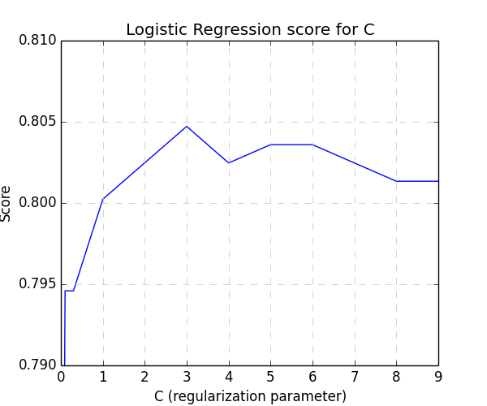

Etude du dataset Titanic
========================

### Présentation
Ce jeu de données est proposé par [Kaggle.com](http://www.kaggle.com/c/titanic-gettingStarted) comme projet d'initiation.
Les données rassemblent le nom et certaines caractéristiques des 1309 passagers du Titanic, divisées en deux ensembles :
- les données d'entraînement ([train.csv](train.csv)), comprenant 891 passagers, avec pour chacun d'entre eux un flag (0 ou 1) indiquant s'il a survécu au naufrage ;
- les données de test ([test.csv](test.csv)), comprenant les 418 passagers restant, pour lesquels l'objectif est de prédire s'ils ont survécu ou non.

Les participants au concours soumettent leurs prédictions au site Kaggle.com, qui les évalue sur 50% (non révélés) des données de test. A l'issue du concours, le classement final sera établi sur le score obtenu pour les 50% restant.

Les données fournies pour chaque passager sont les suivantes :  **Classe** du voyageur (1ère, 2ème ou 3ème), **Nom** complet, **Sexe**, **Age**, Nombre de **conjoints, frères et soeurs** à bord, Nombre de **parents et enfants** à bord, Référence du **billet** d'embarquement, **Tarif** du billet d'embarquement, Référence de la **cabine**, Port d'**embarquement** (Cherbourg, Southampton ou Queenstown (Irlande)).

L'exploration a été réalisée en Python 2.7.

### Première analyse des données
> [01_first_steps.py](01_first_steps.py)

Un passage préliminaire sur les données d'apprentissage fait apparaître que 38,4% des passagers de ce fichier ont survécu.
Cependant, le taux de survie est nettement plus contrasté si l'on divise la population selon le sexe et selon le prix déboursé comme le ticket :

| Prix du billet 	| < £10 	| £10 <= prix < £20 	| £20 <= prix < £30 	| £30 <= prix 	|
|----------------	|-------	|-------------------	|-------------------	|-------------	|
| Hommes         	| 10,6% 	| 18,8%             	| 24,1%             	| 33,6%       	|
| Femmes         	| 59,4% 	| 73,1%             	| 68,4%             	| 86,1%       	|

### Modèle *ad hoc*
Compte-tenu de cette analyse assez rapide et aisée, il est possible de mettre en place un modèle de prédiction *ad hoc* sans faire intervenir un algorithme d'apprentissage. (Ce modèle est proposé par le tutoriel associé au concours sur le site de Kaggle.com).
A ces deux variables discriminantes (sexe et prix du billet), on ajoute la classe de la cabine.

#### Processus
- Rassembler les passagers en 24 catégories (2 sexes x 3 classes x 4 intervalles de prix) ;
- Pour chaque catégorie, calculer le taux de survie dans le jeu de données d'entraînement ;
- Pour chaque passager du jeu de test, déterminer dans quelle catégorie il ou elle se trouve, et prédire sa survie si le taux de survie de cette catégorie est >= 50%.

#### Difficultés
- Les prix des billets sont simplifiés en 4 intervalles de prix ; il faut transformer le prix pour chaque passager en l'index de l'intervalle correspondant (exemple : un tarif de £12 sera dans le deuxième intervalle, entre £10 et £20).
- Certaines catégories ne correspondent à aucun passager du jeu de données d'apprentissage ; le taux de survie est alors placé arbitrairement à 0%. Après tout, le taux de survie global pour tous les passagers (38,4%) est inférieur à 50%.
- Le prix du billet (*fare*) n'est pas renseigné pour tous les passagers. Dans ce cas, on fait le choix d'utiliser la classe pour approximer l'intervalle de prix :

| Classe     | 1ère   | 2ème   | 3ème |
|------------|--------|--------|------|
| Intervalle approx. | £20-30 | £10-20 | <£10 |

#### Score
Le score utilisé dans ce concours est l'*Accuracy*. Celle-ci peut se représenter :

> *Accuracy = Nombre de prédictions correctes / Nombre total de prédictions.*

Sur notre jeu de données d'apprentissage, cette valeur donne **0.80808**.
Toutefois, le score sur les données qui ont servies à l'apprentissage n'est pas fiable pour évaluer la capacité prédictive d'un modèle.

J'ai généré les [prédictions de ce modèle](01_submission.csv) sur les données de test que j'ai uploadé sur le site Kaggle.com ; son *Accuracy* (sur 50% du jeu de test) est évaluée à **0.77990**.

### Utilisation du framework Pandas
> [02_with_pandas.py](02_with_pandas.py)

La librairie **Pandas** facilite le chargement et la manipulation de données sous forme structurée. Elle sera utilisée dans le reste des travaux pour, notamment, aisément charger les fichiers et faire référence aux colonnes de données (les *features*) par leur nom. Par exemple :
```python
data = pandas.read_csv('train.csv', header=0)  # feature names on line 0
Y = data['Survived']
```

Plutôt que :
```python
data = []
with open('train.csv', 'r') as f:
	for row in csv.reader(f):
		data.append(row)
data = numpy.array(train[1:])
Y = data[:, 1]
```

Le même modèle *ad hoc* est ré-implémenté en utilisant les structures de données Pandas (nommées *dataframes*).
Les prédictions sont, fort heureusement, les mêmes.

Ce travail n'apporte pas de valeur à l'exploration statistique mais permettra de faciliter le codage ultérieur et de lui apporter de la lisibilité.

### "Nettoyage" des données
On constate sur ce jeu de données un inconvénient souvent présent dans les travaux de *machine learning* : l'absence de certaines données (*features*) pour certains passagers.

Il n'y a pas vraiment de règles absolues dans ce cas. On peut laisser les valeurs "absentes" dans les données, avec des conséquences variables selon l'algorithme utilisé. Alternativement on peut remplacer ces valeurs "absentes" par des **valeurs raisonnables**, mais la détermination de celles-ci est alors un paramètre (potentiellement important) du modèle choisi.

#### Age
On constate que **20% des passagers** n'ont pas d'âge précisé, que ce soit pour le jeu d'apprentissage ou le jeu de test.
La stratégie adoptée est de remplacer les données manquantes par l'âge médian des passagers du jeu d'apprentissage de mêmes sexe et classe.

#### Prix du billet
Un passager dans le jeu de test (et aucun dans le jeu d'apprentissage) n'a pas de prix spécifié. S'agissant d'un seul cas sur 1309, on prend le parti de remplacer ce prix absent par 0.

### Régression Logistique
> [03_logistic_regression.py](03_logistic_regression.py)

Le premier algorithme non *ad hoc* essayé est la régression logistique. De manière simplifiée, il s'agit d'une régression linéaire dont les paramètres sont les poids des différentes *features*, plus un terme de "biais" (càd d'ordonnée à l'origine), et dont le résultat est passé dans une fonction sigmoïde afin de le rendre binaire (le passager a-t-il survécu ou pas ?).

La librairie utilisée dans cette exploration est **[scikit-learn](http://scikit-learn.org)**.

#### Paramètre de régularisation
La mise en place d'un modèle de régression logistique nécessite de fixer la valeur d'un paramètre *C*, qui représente l'inverse du paramètre de régularisation lambda.

Ce paramètre est destiné à prévenir le risque d'*overfitting*, c'est à dire d'obtenir un modèle très performant sur les données d'apprentissage, mais **non généralisable** pour la prédiction de données ultérieures.

La fonction de coût qui est optimisée (c'est à dire minimisée) pour mettre en place un algorithme de régression logistique est la suivante :
> *J(T) = [ Somme(Erreurs) + (1 / C ) x Somme(T^2) ] / (2 x m) *
T étant le vecteur des poids des différentes *features*
m étant le nombre d'exemples (de passagers) dans le jeu d'apprentissage

"*Erreurs*" représente ici le vecteur des différences entre les valeurs prédites et les valeurs connues pour la donnée à prédire (le passager a-t-il survécu ?).
On obtient donc un compromis entre la modélisation des données du jeu d'apprentissage (le premier terme de l'addition) et le fait que **les poids doivent rester de magnitude raisonnable** (le second terme) pour limiter l'*overfitting*.

*C* permet de régler l'intensité du second terme, et donc l'intensité de la régularisation. L'existence de ce paramètre pose la question de sa valeur optimale, qui doit être ré-évaluée pour chaque jeu de données particulier.

#### Cross-validation
Comme vu plus haut, le calcul du score d'un modèle sur les données d'apprentissage qui ont servi à le déterminer n'a pas beaucoup de valeur : un score élevé ne présageant pas d'une bonne généralisation ultérieure (par exemple en cas d'*overfitting*).

Toutefois, le jeu de test fourni de propose pas l'information de survie des passagers qui le composent. Il est donc impossible de l'utiliser pour mesurer un score et **comparer rapidement des modèles entre eux** (on peut uploader les prédictions sur Kaggle.com et vérifier le score sur 50% du jeu de test, mais d'une part le processus est manuel, et d'autre part il est limité à 10 tentatives par tranche de 12 heures).

La technique de la cross-validation permet de mesurer un **score objectif pour un modèle**, uniquement à partir des données d'apprentissage. Le principe est de scinder le jeu d'apprentissage en deux ensembles représentant (par exemple) 70% et 30% des données, de générer le modèle par l'apprentissage sur les 70%, et de calculer le score sur les 30% restant.

Pour cette exploration, on a utilisé l'algorithme **K-Fold**, qui applique ce principe en le répétant *K* fois avec deux ensembles d'apprentissage et de validation différents à chaque fois, et fait la moyenne des *K* scores ainsi calculés pour déterminer le score final.

On a pris *K* = **8**, de sorte que chaque passe a été réalisée avec 7/8 = 87,5% de train.csv pour l'apprentissage et 12,5% pour le calcul du score (1145 et 164 passagers respectivement).

**Cette cross-validation a été employée pour tous les calculs de score présentés dans la suite de ce compte-rendu** (hormis les scores fournis par Kaggle.com après upload des prédiction sur les données de test).

#### Détermination du paramètre *C*
Un algorithme de régression logistique est entraîné sur les données d'apprentissage pour une série croissante de valeurs de *C* (de 0.01 à 9), le score pour chaque valeur étant calculé par cross-validation en K-Fold avec K=8.



On constate que le score est à son maximum pour une valeur de *C* = **3**. Le score de cross-validation est alors de **0.80583**.

#### Prédictions sur les données de test
Une fois les meilleurs paramètres définis, on calcule un modèle définitif avec ces paramètres et sur **l'ensemble** des passagers des données d'apprentissage.

Ce modèle peut ensuite être utilisé pour établir les prédictions concernant les passagers des données de test.

Soumis sur le site Kaggle.com, le score sur les données de test est de **0.56938**.

|&nbsp;| Score d'apprentissage | Score de test Kaggle.com |
|-|-|-|
| Modèle *ad hoc* | 0.80808 | 0.77990 |
| Régression logistique | 0.80583 | 0.56938 |

On constate que la régression logistique a un score quasiment semblable à celui du modèle *ad hoc* sur les données d'apprentissage, mais beaucoup plus faible sur les données de test. On a donc clairement un type de modèle qui ne se généralise pas bien.
Il est nécessaire de déterminer pourquoi la régression logistique n'est pas applicable au jeu de données.

> Written with [StackEdit](https://stackedit.io/).